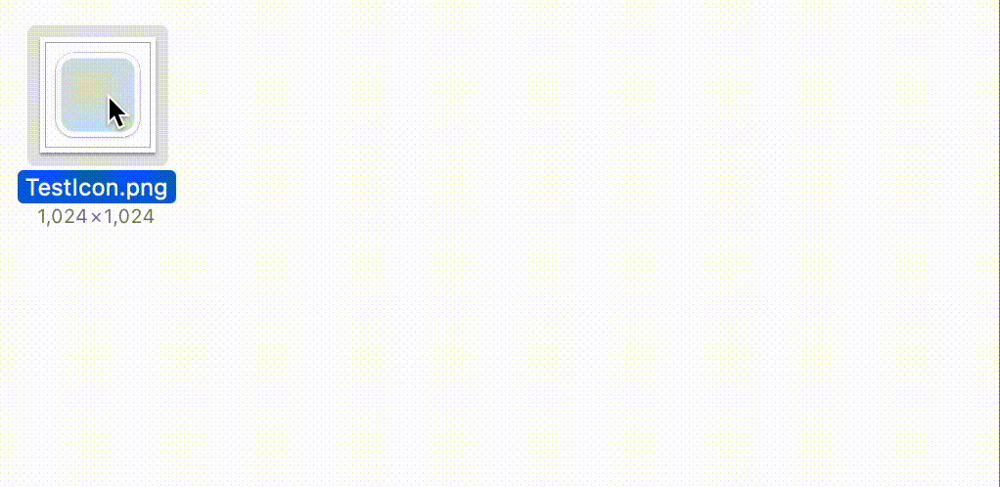

  
  <h1>png2icns-shortcut</h1>
  
Apple Shortcut for macOS

## About
This shortcut allows you to generate `icns` file from a single 1024x1024 `png` image.  

  

## Installation
1. Download `png2icns.shortcut` from this [link](png2icns.shortcut)

2. Double-click to open `png2icns.shortcut`

3. Shortcut app window appears, then click `Add Shortcut`  

  

## Usage
1. Prepare a 1024x1024 icon image in `png` format

2. Right-click on the image and select `Quick Actions`

3. Choose `png2icns`

4. You will be prompted for privacy control, click `OK` to continue  
> **Note**  
This shortcut does not change any existing data. If you are worried, you can check inside the shortcut to understand what this shortcut does.

  

5. You may be asked more about privacy control, select `Allow Once` or `Allow Always`  

  

6. The `icns` file will be generated in the same directory!

## Contents of `icns` file
Generated `icns` file contains 10 different sized images.  

| index | internal name | size |
| ---: | :--- | :--- |
| 1 | icon_512x512@2x | 1024x1024 |
| 2 | icon_512x512 | 512x512 |
| 3 | icon_256x256@2x | 512x512 |
| 4 | icon_256x256 | 256x256 |
| 5 | icon_128x128@2x | 256x256 |
| 6 | icon_128x128 | 128x128 |
| 7 | icon_32x32@2x | 64x64 |
| 8 | icon_32x32 | 32x32 |
| 9 | icon_16x16@2x | 32x32 |
| 10 | icon_16x16 | 16x16 |

